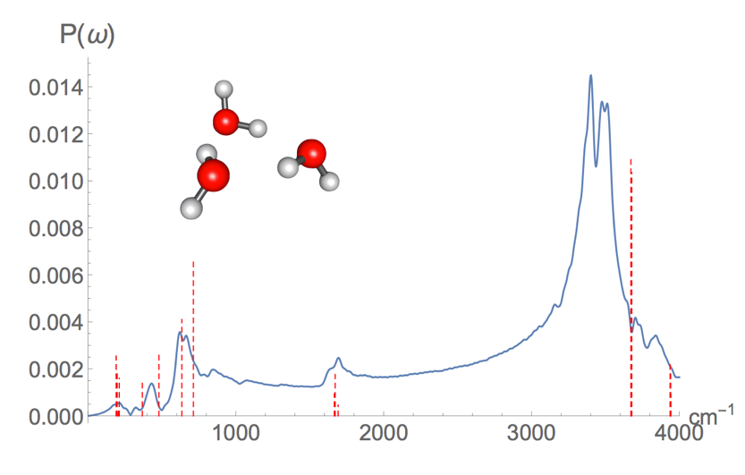

# &#9658;TensorMol 0.1
A Statistical Model of Molecular Structure

### Authors:
 Kun Yao (kyao@nd.edu), John Herr (John.E.Herr.16@nd.edu),
 David Toth (dtoth1@nd.edu), John Parkhill (john.parkhill@gmail.com)

### Model Chemistries:
 - Behler-Parrinello
 - Many Body Expansion
 - Bonds in Molecules NN
 - Atomwise Forces

### Simulation Types:
 - Optimizations
 - Nudged Elastic Band
 - Molecular Dynamics (NVE,NVT Nose-Hoover)
 - Meta-Dynamics
 - Infrared spectra

### License: GPLv3
By using this software you agree to the terms in COPYING

### Acknowledgements:
 - Google Inc. (for TensorFlow)
 - NVidia Corp. (hardware)
 - Vol Lillenfeld Group (for GBD9)
 - Chan Group (for PySCF)

### Sample Results
 "Water IR spectrum generated from test.py, david_testIR()"

### Installation:
```
git clone https://github.com/jparkhill/TensorMol.git
cd TensorMol
pip install -e .
python test.py
```

### Usage:
 - ```import TensorMol as tm```
 - Please also refer to IPython notebooks in /notebooks.

### Requirements:
- Minimum Pre-Requisites: Python2.7x, TensorFlow
- Useful Pre-Requisites: CUDA7.5, PySCF
- To Train Minimally: ~100GB Disk 20GB memory
- To Train Realistically: 1TB Disk, GTX1070++
- To Evaluate: Normal CPU and 10GB Mem

### Common Issues:
- nan during training due to bad checkpoints in /networks (clean.sh)
- Also crashes when reviving networks from disk.
- if you have these issues try:

```
cd C_API/
sudo python setup.py install
cd ..
sh clean.sh
```
