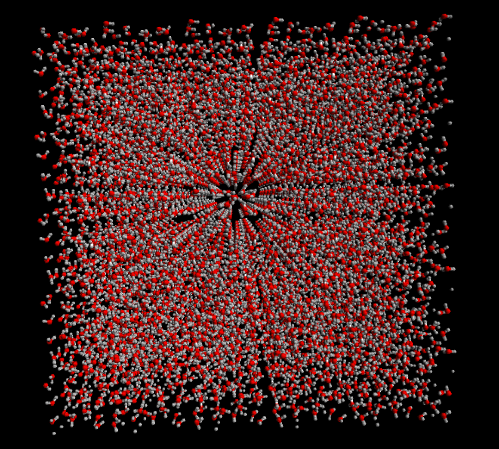
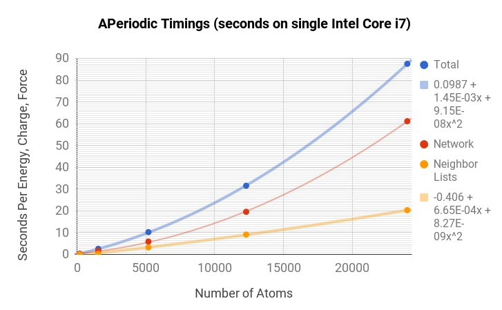
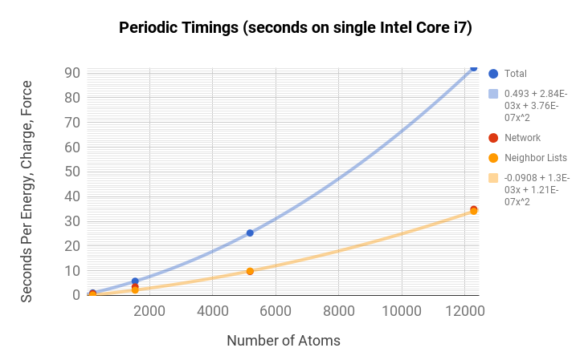

# &#9658;TensorMol 0.1

-Title signature by Alex Graves' handwriting LSTM https://arxiv.org/abs/1308.0850

### Authors:
 Kun Yao (kyao@nd.edu), John Herr (jherr1@nd.edu),
 David Toth (dtoth1@nd.edu), Ryker McIntyre, Nicolas Casetti
 John Parkhill (john.parkhill@gmail.com)

### Model Chemistries:
 - Behler-Parrinello with electrostatics
 - Many Body Expansion
 - Bonds in Molecules NN
 - Atomwise Forces
 - Inductive Charges

### Simulation Types:
 - Optimizations
 - Molecular Dynamics (NVE,NVT Nose-Hoover)
 - Monte Carlo
 - Open/Periodic Boundary Conditions
 - Meta-Dynamics
 - Infrared spectra by propagation
 - Infrared spectra by Harmonic Approximation.
 - Nudged Elastic Band
 - Path integral simulations via interface with [I-PI](https://github.com/i-pi/i-pi) MD engine.

### License: GPLv3
By using this software you agree to the terms in COPYING

### Installation:
 - Works on OSX, Ubuntu, and Windows subsystem for Linux.
```
git clone https://github.com/jparkhill/TensorMol.git
cd TensorMol
# If you are using python2x
sudo pip install -e .
# If you are using python3x
sudo pip3 install -e .
python test.py
```

### Usage:
 - ```import TensorMol as tm```
 - TensorMol assumes a directory structure executing path which mirrors the git.
 - Please also refer to IPython notebooks in /notebooks.
 - IPI interface: start server: ~/i-pi/i-pi samples/i-pi_interface/H2O_cluster.xml > log &; run client: python test_ipi.py

### Timing Information
TensorMol is robust and fast. You can get an energy and force of this monstrous cube of 24,000 atoms
in less than 100 seconds on a 2015 MacbookPro (Core i7 2.5Ghz, 16GB mem). Periodic simulations are about 3x
more expensive at present time.




### Sample Results


- Water Trimer IR spectrum generated with david_testIR() in test.py
- The red lines are MP2(qchem) solid line is TensorMol's IR propagation.

### Requirements:
- Minimum Pre-Requisites: Python2.7x, TensorFlow
- Python3x support coming soon.
- Useful Pre-Requisites: CUDA7.5, PySCF
- To Train Minimally: ~100GB Disk 20GB memory
- To Train Realistically: 1TB Disk, GTX1070++
- To Evaluate: Normal CPU and 10GB Mem

### Acknowledgements:
 - Google Inc. (for TensorFlow)
 - NVidia Corp. (hardware)
 - von Lilienfeld Group (for GBD9)
 - Chan Group (for PySCF)

### Common Issues:
- nan during training due to bad checkpoints in /networks (clean.sh)
- Also crashes when reviving networks from disk.
- if you have these issues try re-installing or:

```
sh clean.sh
```
