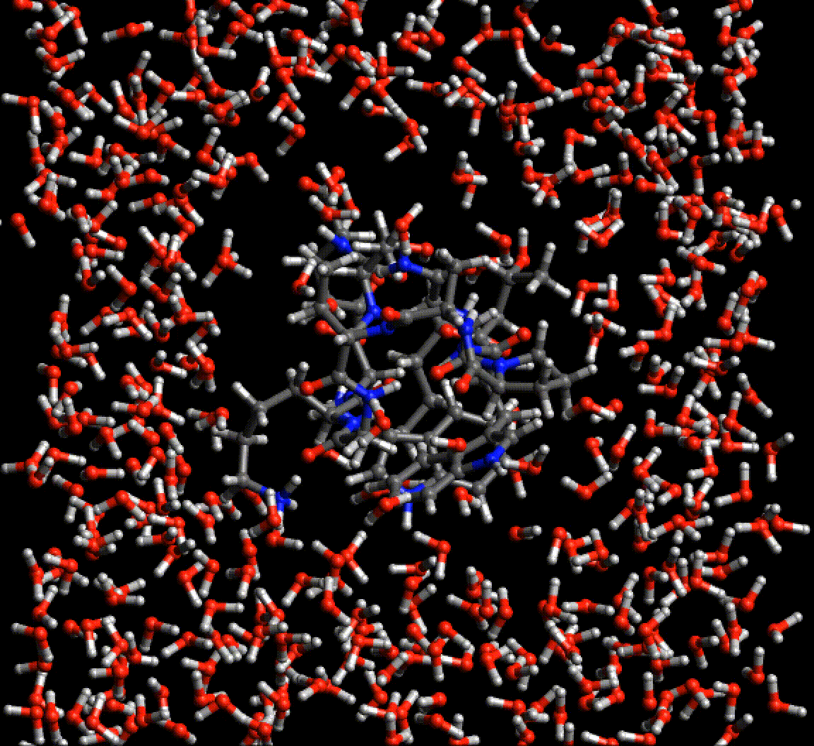
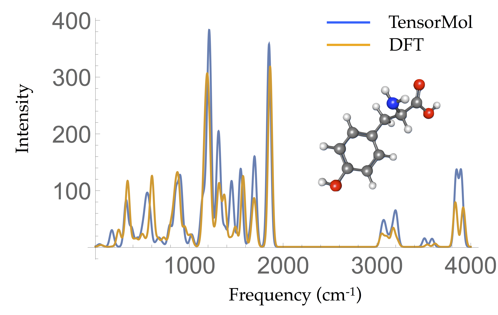

# &#9658;

-Title signature by Alex Graves' handwriting LSTM https://arxiv.org/abs/1308.0850

[](https://badge.fury.io/py/TensorMol)

[](http://tensormol.readthedocs.io/en/latest/?badge=latest)


## Authors:
 Kun Yao (kyao@nd.edu), John Herr (jherr1@nd.edu),
 David Toth (dtoth1@nd.edu), Ryker McIntyre(rmcinty3@nd.edu), Nicolas Casetti,
 [John Parkhill](http://blogs.nd.edu/parkhillgroup) (john.parkhill@gmail.com)

## Model Chemistries:
 - Behler-Parrinello with electrostatics
 - Many Body Expansion
 - Bonds in Molecules NN
 - Atomwise Forces
 - Inductive Charges

## Simulation Types:
 - Optimizations
 - Molecular Dynamics (NVE,NVT Nose-Hoover)
 - Monte Carlo
 - Open/Periodic Boundary Conditions
 - Meta-Dynamics
 - Infrared spectra by propagation
 - Infrared spectra by Harmonic Approximation.
 - Nudged Elastic Band
 - Path integral simulations via interface with [I-PI](https://github.com/i-pi/i-pi) MD engine.

## License: GPLv3
By using this software you agree to the terms in COPYING

## Installation:
 - Install TensorFlow(>1.1), otherwise TensorMol is self-contained.
 - Works on OSX, Ubuntu, and Windows subsystem for Linux:
```
git clone https://github.com/jparkhill/TensorMol.git
cd TensorMol
# If you are using python2x
sudo pip install -e .
# If you are using python3x
sudo pip3 install -e .
python test.py
```

## Test example for TensorMol01:
 - Download our pretrained neural networks (network.tar.gz). [Networks for water and molecules that only contains CHON](https://drive.google.com/drive/folders/1IfWPs7i5kfmErIRyuhGv95dSVtNFo0e_?usp=sharing) (The file is about 6 Gigabyte. This may take a while)
 - Copy the trained networks file into TensorMol folder. Unzip them. The networks should be in './networks' folder.
 - Copy the test script into the tensormol folder:```cp samples/test_tensormol01.py .```. Run the script: ```python test_tensormol01.py```. The test sample contains geometry optimization, molecular dynamic, harmonic IR spectrum and realtime IR spectrum.  

## Timing Information
TensorMol is robust and fast. You can get an BP+electrostatic energy and force of this monstrous cube of 24,000 atoms
in less than 100 seconds on a 2015 MacbookPro (Core i7 2.5Ghz, 16GB mem). Periodic simulations are about 3x
more expensive.  


## Usage:
 - ```import TensorMol as tm```
 - We are working on /doc/Tutorials, but it's sparse now.
 - There is also a lot of examples in /samples/test-ZZZ.py and IPython notebooks in /notebooks.
 - IPI interface: start server: ~/i-pi/i-pi samples/i-pi_interface/H2O_cluster.xml > log &; run client: python test_ipi.py


## Sample Results

### Biological molecules
Because Neural network force fields do not rely on any specific atom typing or bond topology, the agony of setting up  simulations of biological molecules is greatly reduced. This gif is a periodic optimization of PDB structure 2EVQ, in explicit polarizable TensorMol solvent.



### Chemical Reactions
Converged nudged elastic band simulations of the cyclization cascade of endiandric acid C (c.f. K. C. Nicolaou, N. A. Petasis, R. E. Zipkin, 1982, The endiandric acid cascade. Electrocyclizations in organic synthesis. 4. Biomimetic approach to endiandric acids A-G. Total synthesis and thermal studies, J. Am. Chem. Soc. 104(20):5560–5562).


This reaction path can be found in a few minutes on an ordinary laptop. Relaxation from the linearly interpolated guess looks like this:


The associated energy surface is shown below.


### Dynamic Properties
- Tyrosine Harmonic IR spectrum



## Publications and Press:
 - Writeup in [Chemistry World](https://www.chemistryworld.com/news/neural-network-predicts-bond-energies-like-a-pro/3007598.article)
 - Kun Yao, John E. Herr, Seth N. Brown, & John Parkhill. Intrinsic Bond Energies from a Bonds-in-Molecules Neural Network. Journal of Physical Chemistry Letters (2017). DOI: [10.1021/acs.jpclett.7b01072](http://pubs.acs.org/doi/abs/10.1021/acs.jpclett.7b01072)
 - Kun Yao, John Herr, & John Parkhill. The Many-body Expansion Combined with Neural Networks. Journal of Chemical Physics (2016). DOI:  [10.1063/1.4973380](http://aip.scitation.org/doi/abs/10.1063/1.4973380?journalCode=jcp)
 - Kun Yao, John Parkhill. The Kinetic Energy of Hydrocarbons as a Function of Electron Density and  Convolutional Neural Networks. Journal of Chemical Theory and Computation (2016). DOI: [10.1021/acs.jctc.5b01011](http://pubs.acs.org/doi/abs/10.1021/acs.jctc.5b01011)

## Requirements:
- Minimum Pre-Requisites: Python2.7x, TensorFlow
- Python3x support coming soon.
- Useful Pre-Requisites: CUDA7.5, PySCF
- To Train Minimally: ~100GB Disk 20GB memory
- To Train Realistically: 1TB Disk, GTX1070++
- To Evaluate: Normal CPU and 10GB Mem

## Acknowledgements:
 - Google Inc. (for TensorFlow)
 - NVidia Corp. (hardware)
 - von Lilienfeld Group (for GBD9)
 - Chan Group (for PySCF)

## Common Issues:
- nan during training due to bad checkpoints in /networks (clean.sh)
- Also crashes when reviving networks from disk.
- if you have these issues try re-installing or:

```
sh clean.sh
```
